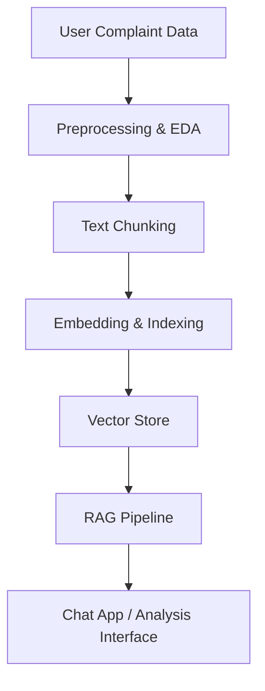

# Intelligent Complaint Analysis for Financial Services


## Table of Contents
- [Summary](#summary)
- [Quickstart](#quickstart)
- [Project Structure](#project-structure)
- [Dependencies & Installation](#dependencies--installation)
- [Features](#features)
- [Workflow](#workflow)
- [Usage](#usage)
- [Data Processing Steps](#data-processing-steps)
- [Links & Resources](#links--resources)
- [Contributing](#contributing)
- [Contact](#contact)

---
## Summary
This project provides an end-to-end, modular pipeline for the intelligent analysis of consumer complaints in the financial services sector, using data from the Consumer Financial Protection Bureau (CFPB). The motivation is to help financial institutions, regulators, and researchers extract actionable insights from large volumes of unstructured complaint narratives, enabling better customer service, regulatory compliance, and risk management.

**Key Features and Workflow:**
- **Data Ingestion & EDA:** Robust loading and exploratory analysis of raw CFPB complaint data, including product distribution, narrative presence, and text length statistics.
- **Data Cleaning & Preprocessing:** Automated filtering for relevant products, removal of empty or low-quality narratives, and advanced text cleaning (boilerplate removal, normalization, etc.).
- **Text Chunking:** Flexible chunking strategies (recursive character, sentence, paragraph, and token-based) to break long complaint narratives into manageable, semantically meaningful pieces, preserving metadata for traceability.
- **Embedding Generation:** State-of-the-art sentence embeddings using transformer models (e.g., all-MiniLM-L6-v2) to convert text chunks into high-dimensional vectors suitable for semantic analysis.
- **Vector Indexing & Semantic Search:** Efficient similarity search and topic-based retrieval using FAISS and ChromaDB, supporting fast, scalable exploration of complaint themes and trends.
- **Batch Processing & Performance Analysis:** Tools for large-scale processing, chunking performance evaluation, and export of results for downstream analytics.
- **Jupyter Notebooks & Scripts:** Ready-to-use notebooks and demo scripts for each stage of the workflow, supporting both interactive exploration and automated pipelines.

**Practical Applications:**
- Rapidly identify emerging complaint topics, fraud patterns, or compliance risks.
- Enable semantic search for customer support teams to find similar cases and improve response quality.
- Support research into consumer protection, financial product issues, and regulatory trends.
- Provide a foundation for advanced analytics such as topic modeling, sentiment analysis, and automated complaint classification.

The codebase is designed for extensibility, reproducibility, and ease of use, with clear modular separation between EDA, preprocessing, chunking, embedding, and indexing components. Extensive documentation, tests, and example workflows are provided to accelerate adoption and adaptation for new datasets or use cases.

---

## Quickstart

1. **Clone the repository:**
   ```bash
   git clone https://github.com/yourusername/Intelligent-Complaint-Analysis-for-Financial-Services.git
   cd Intelligent-Complaint-Analysis-for-Financial-Services
   ```
2. **Install dependencies:**
   ```bash
   pip install -r requirements.txt
   ```
3. **Run a demo script:**
   ```bash
   python scripts/integration_demo.py
   ```
4. **Explore Jupyter notebooks:**
   ```bash
   jupyter notebook notebooks/eda_preprocessing_demo.ipynb
   ```

**Troubleshooting Tips:**
- If you encounter `ModuleNotFoundError`, ensure you are in the correct virtual environment and dependencies are installed.
- If Jupyter is not found, run `pip install notebook`.
- If data files are missing, download the latest [CFPB Consumer Complaint Database](https://www.consumerfinance.gov/data-research/consumer-complaints/) and place it in the `data/` folder as `complaints.csv`.

---

## Project Structure 

```
Intelligent-Complaint-Analysis-for-Financial-Services/
├── data/                           # Raw and processed data files
│   ├── complaints.csv              # Raw CFPB complaints data (downloaded)
│   ├── complaints_processed.csv    # Cleaned and filtered dataset (generated)
│   ├── chunked_narratives.csv      # Chunked narratives (generated)
│   └── chunking_summary.csv        # Chunking statistics (generated)
├── notebooks/                      # Interactive Jupyter notebooks for EDA, chunking, RAG
│   ├── eda_preprocessing_demo.ipynb
│   ├── text_chunking_demo.ipynb
│   └── rag_pipeline_demo.ipynb
├── src/                            # Source code modules
│   ├── eda_preprocessing.py        # ComplaintAnalyzer class for EDA & cleaning
│   ├── text_chunking.py            # Text chunking strategies
│   ├── embedding_indexing.py       # Embedding and vector indexing
│   └── apps/                       # Streamlit chat app, tests, and docs
│       ├── chat_app.py             # Main Streamlit chat interface
│       ├── test_chat.py            # Unit tests for chat app
│       └── README.md               # Streamlit app documentation
├── scripts/                        # Demo and integration scripts
│   ├── demo_text_chunking.py
│   ├── demo_embedding_indexing.py
│   └── integration_demo.py
├── tests/                          # Unit and integration tests
│   ├── test_constructor.py
│   ├── test_text_chunking.py
│   ├── test_embedding_indexing.py
│   └── test_embedding_fix.py
├── vector_store/                   # Vector database files (if using ChromaDB locally)
├── README.md                       # Project documentation
└── requirements.txt                # Python dependencies
```

## Features

### 1. ComplaintAnalyzer Class (EDA & Preprocessing)

A comprehensive Python class that provides:

1. **Data Loading** - Load CFPB complaints CSV with error handling
2. **Exploratory Data Analysis** - Basic dataset exploration and statistics
3. **Data Filtering** - Filter to specific products and remove empty narratives
4. **Text Cleaning** - Clean narratives for better embedding quality
5. **Visualization** - Generate plots and charts for analysis

### 2. Text Chunking Module

Advanced text chunking capabilities for processing long complaint narratives:

1. **Multiple Chunking Strategies** - Recursive character, sentence-based, paragraph-based
2. **Configurable Parameters** - Adjustable chunk size and overlap
3. **Metadata Preservation** - Maintains traceability to original complaints
4. **Performance Analysis** - Comprehensive chunking statistics and optimization

### 3. Embedding and Indexing Module

State-of-the-art embedding and semantic search capabilities:

1. **Embedding Model** - sentence-transformers/all-MiniLM-L6-v2 for optimal performance
2. **Vector Storage** - ChromaDB for efficient similarity search
3. **Metadata Preservation** - Complete traceability for each chunk
4. **Semantic Search** - Fast and accurate similarity search with filtering
5. **Batch Processing** - Efficient handling of large datasets

### Key Methods

#### ComplaintAnalyzer
- `load_complaints_data()` - Load complaints data with error handling
- `initial_eda()` - Perform initial exploratory data analysis
- `plot_product_distribution()` - Visualize complaint distribution by product
- `analyze_narrative_lengths()` - Analyze text length characteristics
- `count_narrative_presence()` - Count narratives vs non-narratives
- `filter_dataset()` - Filter to 5 specified products and remove empty narratives
- `clean_narratives()` - Clean text for better embedding quality

#### Text Chunking
- `chunk_single_narrative()` - Chunk a single narrative text
- `chunk_narratives_batch()` - Process multiple narratives with metadata
- `analyze_performance()` - Analyze chunking performance metrics
- `save_results()` - Save chunked results to various formats

#### Embedding and Indexing
- `generate_embeddings()` - Generate embeddings for text chunks
- `index_chunks()` - Index chunks with metadata in ChromaDB
- `search_similar_chunks()` - Perform semantic similarity search
- `search_complaints_by_topic()` - Topic-based search with filtering
- `get_collection_stats()` - Get vector store statistics

## Streamlit Chat App: Financial Complaint Analysis

A user-friendly web interface for interacting with the RAG-based financial complaint analysis system.

**Key Features:**
- 🤖 AI-powered answers to questions about financial complaints
- 📚 Source document display for transparency
- 💬 Real-time chat interface with session management
- 🎛️ Sidebar controls for clearing chat and refreshing the system
- ⚡ Robust error handling and user guidance

**How to Launch:**
```bash
streamlit run src/apps/chat_app.py
```

**How to Use:**
1. Type your question in the chat input (e.g., "What are common credit card complaints?")
2. View AI-generated answers and supporting sources
3. Use sidebar controls to clear chat or refresh the system

**Example Questions:**
- "What are common credit card complaints?"
- "How do customers feel about loan services?"
- "What issues do people have with banking apps?"

**Testing the App:**
```bash
python src/apps/test_chat.py
```

For more details, see [`src/apps/README.md`](src/apps/README.md).

## Workflow

The recommended workflow follows this order:

### Phase 1: EDA and Preprocessing
1. **Data Loading** - Load raw complaints data
2. **Original Analysis** - Analyze raw dataset to understand characteristics
3. **Data Filtering** - Filter to specific products and remove empty narratives
4. **Text Cleaning** - Clean narratives for better embedding quality
5. **Final Analysis** - Analyze the cleaned and filtered dataset

### Phase 2: Text Chunking
6. **Chunking Strategy** - Choose appropriate chunking method and parameters
7. **Batch Processing** - Process narratives into manageable chunks
8. **Performance Analysis** - Analyze chunking effectiveness and optimize

### Phase 3: Embedding and Indexing
9. **Embedding Generation** - Generate vector embeddings using sentence-transformers/all-MiniLM-L6-v2
10. **Vector Storage** - Index embeddings with metadata in ChromaDB
11. **Semantic Search** - Enable similarity search and topic-based retrieval

## Usage

### Example Output

- **Product Distribution Plot:**
  
- **Sample Semantic Search Result:**
  ```json
  [
    {
      "complaint_id": 123456,
      "narrative": "I was charged twice for a single transaction...",
      "similarity_score": 0.92
    },
    ...
  ]
  ```

### Extending the Pipeline
- Add new chunking strategies by subclassing `NarrativeChunkingStrategy` in `src/text_chunking.py`.
- Swap embedding models by editing `src/embedding_indexing.py`.
- Integrate with other vector stores (e.g., Pinecone, Weaviate) by adapting the indexer class.

### Using the Jupyter Notebooks

1. **EDA and Preprocessing**: Navigate to `notebooks/` and open `eda_preprocessing_demo.ipynb`
2. **Text Chunking**: Open `text_chunking_demo.ipynb` for chunking workflow
3. Run all cells to execute the complete workflow

### Using the Classes Directly

#### EDA and Preprocessing
```python
from src.eda_preprocessing import ComplaintAnalyzer

# Create analyzer and load data
analyzer = ComplaintAnalyzer('data/complaints.csv')

# Perform analysis
analyzer.initial_eda()
analyzer.plot_product_distribution()

# Filter and clean
analyzer.filter_dataset()
analyzer.clean_narratives()

# Final analysis
analyzer.analyze_narrative_lengths(column_name='Consumer complaint narrative_cleaned')
```

#### Text Chunking
```python
from src.text_chunking import NarrativeChunkingStrategy

# Create chunking strategy
strategy = NarrativeChunkingStrategy(chunk_size=400, chunk_overlap=100)

# Chunk narratives
chunked_narratives = strategy.chunk_narratives_batch(narratives)

# Analyze performance
performance = strategy.analyze_performance(chunked_narratives)
```

#### Embedding and Indexing
```python
from src.embedding_indexing import create_embedding_indexer

# Create indexer
indexer = create_embedding_indexer()

# Index chunks
success = indexer.index_chunks(chunked_narratives)

# Search for similar complaints
results = indexer.search_similar_chunks("fraudulent charges", n_results=10)
```

### Running Demo Scripts

```bash
# Text chunking demo
python scripts/demo_text_chunking.py

# Embedding and indexing demo
python scripts/demo_embedding_indexing.py

# Complete integration demo
python scripts/integration_demo.py
```

### Running Tests

```bash
# Run all tests
python -m pytest tests/

# Run specific test modules
python tests/test_text_chunking.py
python tests/test_embedding_indexing.py
```

## Data Processing Steps

### 1. Data Filtering
- **Products**: Credit card, Personal loan, Buy Now Pay Later (BNPL), Savings account, Money transfers
- **Narratives**: Remove records with empty Consumer complaint narrative fields

### 2. Text Cleaning
- **Lowercasing**: Convert all text to lowercase
- **Boilerplate Removal**: Remove common complaint boilerplate text
- **Special Characters**: Remove punctuation and special characters
- **Whitespace Normalization**: Clean up extra spaces and formatting
- **Quality Control**: Remove narratives that become too short after cleaning

### 3. Output Generation
- **Visualizations**: Product distributions, narrative length histograms
- **Statistics**: Before/after comparisons, data quality metrics
- **Processed Data**: Clean CSV file ready for NLP tasks

## Dependencies & Installation

- Python 3.8+
- See `requirements.txt` for all dependencies.
- Major packages:
  - pandas
  - numpy
  - matplotlib
  - seaborn
  - sentence-transformers
  - faiss
  - chromadb
  - langchain (optional, for advanced chunking)

**Install all dependencies:**
```bash
pip install -r requirements.txt
```

## Links & Resources

- [CFPB Consumer Complaint Database](https://www.consumerfinance.gov/data-research/consumer-complaints/)
- [Sentence Transformers Documentation](https://www.sbert.net/)
- [FAISS Documentation](https://github.com/facebookresearch/faiss)
- [ChromaDB Documentation](https://docs.trychroma.com/)
- [LangChain Documentation](https://python.langchain.com/)

## Contributing

- Please review the [Code of Conduct](https://github.com/yourusername/Intelligent-Complaint-Analysis-for-Financial-Services/blob/main/CODE_OF_CONDUCT.md) before contributing.
- Run `pre-commit` hooks if configured: `pip install pre-commit && pre-commit run --all-files`.

## Contact
*For questions, suggestions, or collaboration, feel free to reach out:*
- GitHub: [wondifraw](https://github.com/wondifraw)
- Email: [wondebdu@gmail.com](mailto:wondebdu@gmail.com)

## Acknowledgements
- [CFPB Consumer Complaint Database](https://www.consumerfinance.gov/data-research/consumer-complaints/)
- [Sentence Transformers](https://www.sbert.net/)
- [FAISS](https://github.com/facebookresearch/faiss)
- [ChromaDB](https://docs.trychroma.com/)
- [LangChain](https://python.langchain.com/)

## Project Goals
- Enable financial institutions and regulators to extract actionable insights from large-scale consumer complaint data.
- Provide a modular, reproducible pipeline for complaint analysis, from raw data to semantic search and interactive exploration.
- Support research and operational use cases: trend detection, compliance monitoring, customer support, and risk management.

## Methodology
1. **Data Ingestion & EDA:** Load and explore CFPB complaint data, analyze product distribution, and narrative statistics.
2. **Data Cleaning & Preprocessing:** Filter for relevant products, remove low-quality narratives, and clean text for NLP tasks.
3. **Text Chunking:** Apply flexible chunking strategies to break long narratives into manageable, semantically meaningful pieces.
4. **Embedding Generation:** Use transformer-based models to convert text chunks into high-dimensional vectors.
5. **Vector Indexing & Semantic Search:** Store embeddings in a vector database (ChromaDB/FAISS) for fast similarity search and topic retrieval.
6. **RAG Pipeline & Chat App:** Integrate retrieval-augmented generation (RAG) for interactive Q&A and analysis via a Streamlit chat interface.

## Project Architecture


## Evaluation Metrics
- **Data Quality:**
  - % of complaints retained after filtering and cleaning
  - Distribution of narrative lengths before/after cleaning
- **Chunking Effectiveness:**
  - Average chunk size, overlap, and coverage
  - Processing speed (chunks/sec)
- **Embedding & Search Quality:**
  - Semantic search accuracy (manual or benchmarked)
  - Latency of similarity search queries
- **User Experience:**
  - Chat app response time
  - User feedback on answer relevance and transparency


